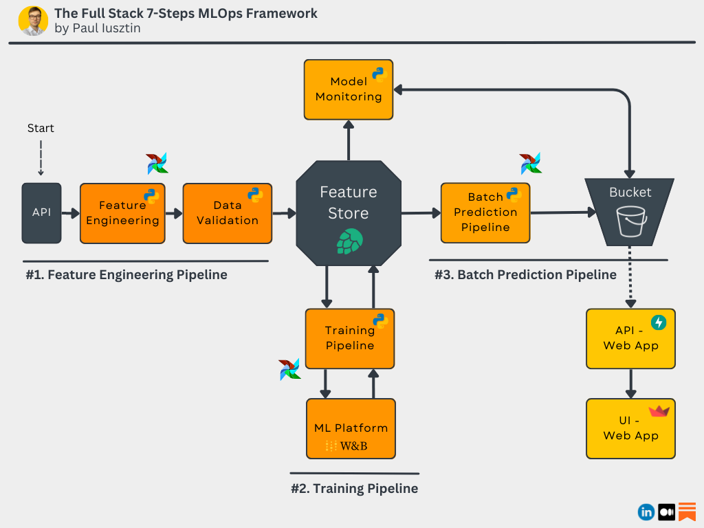
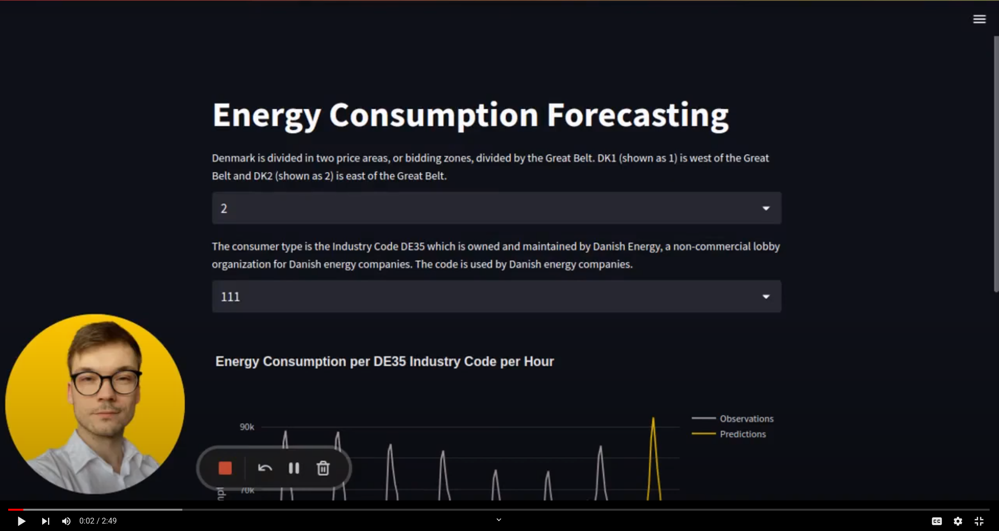
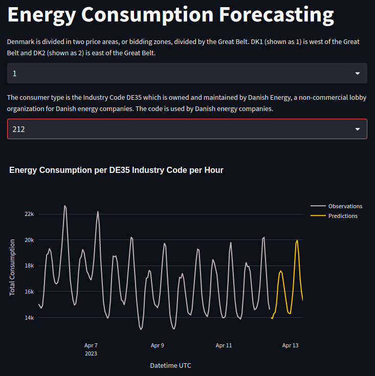
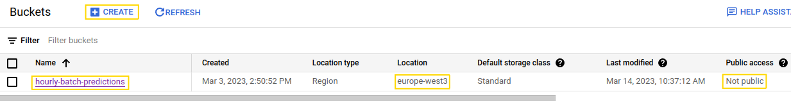
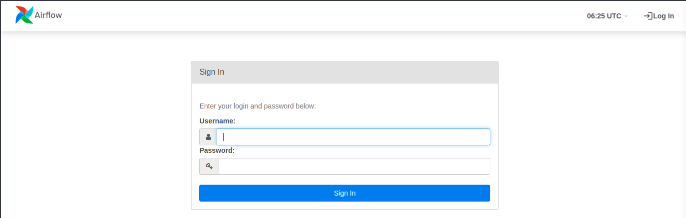
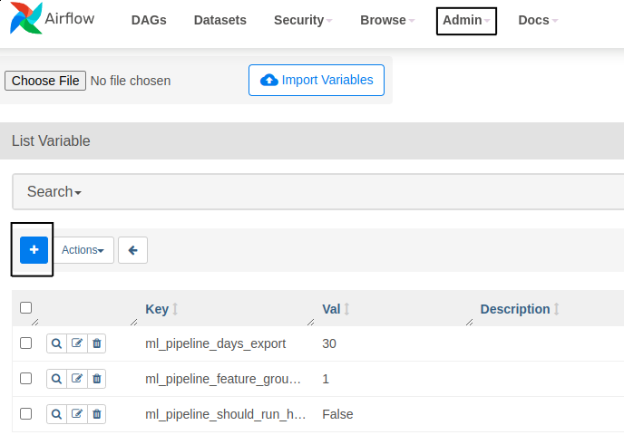
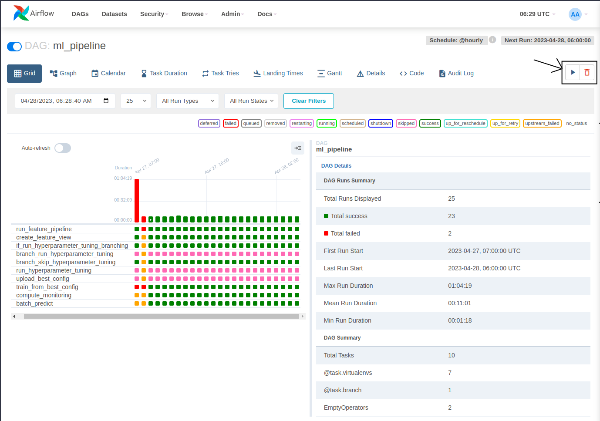
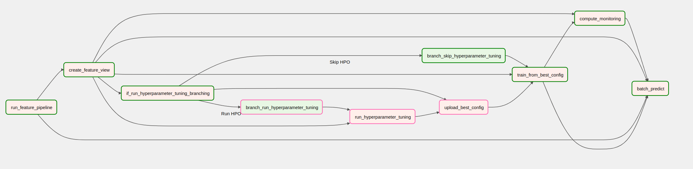

# The Full Stack 7-Steps MLOps Framework

`Learn MLE & MLOps for free by designing, building, deploying and monitoring an end-to-end ML batch system | source code + 2.5 hours of reading & video materials on Medium`

This repository contains a **7-lesson FREE course** to teach you how to **build a production-ready ML batch system**. Its primary focus is to engineer a scalable system using MLOps good practices. You will implement an ML system for forecasting hourly energy consumption levels across Denmark.

You will **learn how to build, train, serve, and monitor an ML system** using a batch architecture. We will show you how to integrate an experiment tracker, a model registry, a feature store, Docker, Airflow, GitHub Actions and more!

**Level:** Intermediate to Advanced | This **course targets** MLEs who want to build end-to-end ML systems and SWEs who wish to transition to MLE.

------

Following the **documentation on GitHub** and the [lessons on Medium](#lessons), you have *2.5 hours of reading & video materials*, which will help you understand every piece of the code!

**At the end of the course, you will know how to build everything from the diagram below 👇**

Don't worry if something doesn't make sense to you. We will explain everything in detail in the [Medium lessons](#lessons).

If you are unsure if this course is for you, [here is an article presenting a high-level overview](https://pub.towardsai.net/the-full-stack-7-steps-mlops-framework-6599a0c6e295) of all the components you will build during the series.

<p align="center">
  
</p>

<div align="center">
  <a href="https://youtu.be/OKk9U310qYE">
    <strong>Check out this short video to see what you will build during the course 👇</strong>
    <br/>
    <br/>
    
  </a>
</div>

<br/>
<br/>

*You can safely use this code as you like, as long as you respect the terms and agreement of the MIT License.*

``<<< Using all the tools suggested in the course will be free of charge, except the ones from Lesson 7, where you will be deploying your application to GCP which will cost you ~20$. >>>``

# Table of Contents
1. [What You Will Learn](#learn)
2. [Lessons & Tutorials](#lessons)
3. [Data](#data)
4. [Code Structure](#structure)
5. [Set Up Additional Tools](#tools)
6. [Usage](#usage)
7. [Installation & Usage for Development](#installation)
8. [Licensing & Contributing](#licensing)

--------

# 🤔 1. What You Will Learn <a name=learn></a>
**At the end of this 7 lessons course, you will know how to:**
* design a batch-serving architecture
* use Hopsworks as a feature store
* design a feature engineering pipeline that reads data from an API
* build a training pipeline with hyper-parameter tunning
* use W&B as an ML Platform to track your experiments, models, and metadata
* implement a batch prediction pipeline
* use Poetry to build your own Python packages
* deploy your own private PyPi server
* orchestrate everything with Airflow
* use the predictions to code a web app using FastAPI and Streamlit
* use Docker to containerize your code
* use Great Expectations to ensure data validation and integrity
* monitor the performance of the predictions over time
* deploy everything to GCP
* build a CI/CD pipeline using GitHub Actions

If that sounds like a lot, don't worry. After you cover this course, you will understand everything we said before. Most importantly, you will know WHY we used all these tools and how they work together as a system.

# 🤌 2. Lessons & Tutorials <a name=lessons></a>

The course consists of 7 lessons hosted on Medium Towards Data Science publication. We also provide a bonus lesson where we openly discuss potential improvements that could be made to the current architecture and trade-offs we had to take during the course. The course adds up to *2.5 hours of reading and video materials*. 

`We recommend running the code along the articles to get the best out of this course, as we provide detailed instructions to set everything up.`

**👇 Access the step-by-step lessons on Medium 👇**

Here is an [article presenting a high-level overview](https://pub.towardsai.net/the-full-stack-7-steps-mlops-framework-6599a0c6e295) of all the components you will build during the course.

1. [Batch Serving. Feature Stores. Feature Engineering Pipelines.](https://medium.com/towards-data-science/a-framework-for-building-a-production-ready-feature-engineering-pipeline-f0b29609b20f)
2. [Training Pipelines. ML Platforms. Hyperparameter Tuning.](https://medium.com/towards-data-science/a-guide-to-building-effective-training-pipelines-for-maximum-results-6fdaef594cee)
3. [Batch Prediction Pipeline. Package Python Modules with Poetry.](https://medium.com/towards-data-science/unlock-the-secret-to-efficient-batch-prediction-pipelines-using-python-a-feature-store-and-gcs-17a1462ca489)
4. [Private PyPi Server. Orchestrate Everything with Airflow.](https://towardsdatascience.com/unlocking-mlops-using-airflow-a-comprehensive-guide-to-ml-system-orchestration-880aa9be8cff)
5. [Data Validation for Quality and Integrity using GE. Model Performance Continuous Monitoring.](https://towardsdatascience.com/ensuring-trustworthy-ml-systems-with-data-validation-and-real-time-monitoring-89ab079f4360)
6. [Consume and Visualize your Model's Predictions using FastAPI and Streamlit. Dockerize Everything.](https://towardsdatascience.com/fastapi-and-streamlit-the-python-duo-you-must-know-about-72825def1243)
7. [Deploy All the ML Components to GCP. Build a CI/CD Pipeline Using Github Actions.](https://towardsdatascience.com/seamless-ci-cd-pipelines-with-github-actions-on-gcp-your-tools-for-effective-mlops-96f676f72012)
8. [\[Bonus\] Behind the Scenes of an ‘Imperfect’ ML Project — Lessons and Insights.](https://towardsdatascience.com/imperfections-unveiled-the-intriguing-reality-behind-our-mlops-course-creation-6ff7d52ecb7e)

---------


# 📊 3. Data <a name=data></a>
We used an open API that provides hourly energy consumption values for all the energy consumer types within Denmark.

They provide an intuitive interface where you can easily query and visualize the data. You can access the data [here](https://www.energidataservice.dk/tso-electricity/ConsumptionDE35Hour).

The data has 4 main attributes:
* **Hour UTC**: the UTC datetime when the data point was observed. 
* **Price Area**: Denmark is divided into two price areas: DK1 and DK2 - divided by the Great Belt. DK1 is west of the Great Belt, and DK2 is east of the Great Belt.
* **Consumer Type**: The consumer type is the Industry Code DE35, owned and maintained by Danish Energy.
* **Total Consumption**: Total electricity consumption in kWh

**Note:** The observations have a lag of 15 days! But for our demo use case, that is not a problem, as we can simulate the same steps as it would be in real time.

### IMPORTANT OBSERVATION

The API will become obsolete during 2023. Its latest data points are from June 2023, and the API will become unavailable during 2023. We created a copy of the data from 2020-07-01 and 2023-06-30 to bypass this issue. Thus, there are 3 years of data to play with. More than enough for the purpose of this course. The file is stored in Google Drive accessible [at this link](https://drive.google.com/file/d/1y48YeDymLurOTUO-GeFOUXVNc9MCApG5/view?usp=drive_link).

Thus, instead of querying the API, we will mock the same behavior by loading the data from the file. Therefore, you don't have to download your file yourself. The code will download it and load the data from the file instead of the API, simulating 100% the same behavior.

**---> All Rights Reserved to: www.energidataservice.dk**


<p align="center">
  
</p>

The data points have an hourly resolution. For example: "2023–04–15 21:00Z", "2023–04–15 20:00Z", "2023–04–15 19:00Z", etc.

We will model the data as multiple time series. Each unique price area and consumer type tuple represents its unique time series. 

Thus, we will build a model that independently forecasts the energy consumption for the next 24 hours for every time series.

[Check out this video to better understand what the data looks like.](https://youtu.be/OKk9U310qYE)

----------

# 🧬 4. Code Structure <a name=structure></a>

The code is split into two main components: the `pipeline` and the `web app`.

The **pipeline** consists of 3 modules:
- `feature-pipeline`
- `training-pipeline`
- `batch-prediction-pipeline`

The **web app** consists of other 3 modules:
- `app-api`
- `app-frontend`
- `app-monitoring`

**Also,** we have the following folders:
- `airflow` : Airflow files | Orchestration
- `.github` : GitHub Actions files | CI/CD
- `deploy` : Build & Deploy
<br/>
<br/>

To follow the structure in its natural flow, read the folders in the following order:
1. `feature-pipeline`
2. `training-pipeline`
3. `batch-prediction-pipeline`
4. `airflow`
5. `app-api`
6. `app-frontend` & `app-monitoring`
7. `.github`

**Read the Medium articles listed in the [Lessons & Tutorials](#lessons) section for the whole experience.**
<br/>
<br/>

-------

# 🔧 5. Set Up Additional Tools <a name=tools></a>

**The code is tested only on Ubuntu 20.04 and 22.04 using Python 3.9.**

We use a `.env` file to store all our credentials. Every module that needs a `.env` file has a `.env.default` in the module's main directory that acts as a template. Thus, you have to run:
```shell
cp .env.default .env
```
... and complete what is surrounded by `<...>`. For now, don't do anything. We will explain in detail in later steps what you have to do. 

If you have problems during the setup, please leave us an issue, and we will respond to you and update the README for future readers.

Also, if you have any questions, you can contact me directly on [LinkedIn](https://www.linkedin.com/in/pauliusztin/).

## Poetry
##### ``<< free usage >>``

**Note:** During the course, we used `Poetry 1.4.2`. To avoid potential issues when installing the dependencies using Poetry, we recommend you use the same version (or if there are any errors & you have a different version, you can delete and regenerate the `poetry.lock` file).

Install Python system dependencies:
```shell
sudo apt-get install -y python3-distutils
```
Download and install Poetry:
```shell
curl -sSL https://install.python-poetry.org | python3 -
```
Open the `.bashrc` file to add the Poetry PATH: 
```shell
nano ~/.bashrc
```

Add `export PATH=~/.local/bin:$PATH`

to `~/.bashrc`

Check if Poetry is installed:
```shell
source ~/.bashrc
poetry --version
```

[If necessary, here are the official Poetry installation instructions.](https://python-poetry.org/docs/#installation)


#### macOS M1/M2 Poetry Issues
**!!!** If you have issues creating Poetry environments on macOS M1/M2 devices, [Hongnan Gao](https://github.com/gao-hongnan) implemented a script that will solve all the dependency issues. Just run the following before creating a Poetry environment:
```shell
bash scripts/install_poetry_macos_m1_chip.sh
```


## Docker
##### ``<< free usage >>``

During the course we used `Docker version 24.0.5`.

* [Install Docker on Ubuntu.](https://docs.docker.com/engine/install/ubuntu/)
* [Install Docker on Mac.](https://docs.docker.com/desktop/install/mac-install/)
* [Install Docker on Windows.](https://docs.docker.com/desktop/install/windows-install/)

## Configure Credentials for the Private PyPi Server
##### ``<< free usage >>``

**<br/>We will run the private PyPi server using Docker down the line. But it will already expect the credentials configured.<br/>**

Create credentials using `passlib`:
```shell
# Install dependencies.
sudo apt install -y apache2-utils
pip install passlib

# Create the credentials under the energy-forecasting name.
mkdir ~/.htpasswd
htpasswd -sc ~/.htpasswd/htpasswd.txt energy-forecasting
```

Set `poetry` to use the credentials:
```shell
poetry config repositories.my-pypi http://localhost
poetry config http-basic.my-pypi energy-forecasting <password>
```

Check that the credentials are set correctly in your poetry `auth.toml` file:
```shell
cat ~/.config/pypoetry/auth.toml
```

## Hopsworks 
##### ``<< free usage >>``

You will use [Hopsworks](https://www.hopsworks.ai/) as your serverless feature store. Thus, you have to create an account and a project on Hopsworks. We will show you how to configure the code to use your Hopsworks project later.

[We explained on Medium in **Lesson 1** how to create a Hopsworks API Key.](https://medium.com/towards-data-science/a-framework-for-building-a-production-ready-feature-engineering-pipeline-f0b29609b20f) But long story short, you can go to your Hopsworks account settings and get the API Key from there. Afterward, you must create a new project (or use the default one) and add these credentials to the `.env` file under the `FS_` prefix.

**!!!** Be careful to name your project differently than **energy_consumption,** as Hopsworks requires unique names across its serverless deployment.

[Click here to start with Hopsworks](https://www.hopsworks.ai/).

**Note:** Our course will use only the Hopsworks freemium plan, making it free of charge to replicate the code within the series. 


## Weights & Biases
##### ``<< free usage >>``

You will use Weights & Biases as your serverless ML platform. Thus, you must create an account and a project on Weights & Biases. We will show you how to configure the code to use your W&B project later.

[On Medium, we explained in **Lesson 2** how to create an API Key on W&B.](https://towardsdatascience.com/a-guide-to-building-effective-training-pipelines-for-maximum-results-6fdaef594cee) But long story short, you can go to your W&B and create an entity & project. Afterward, you must navigate to user settings and create the API Key from there. In the end, you must add these credentials to the `.env` file under the `WANDB_` prefix.

**!!!** Be careful to name your entity differently than **teaching-mlops,** as W&B requires unique names across its serverless deployment.

[Click here to start with Weights & Biases](https://wandb.ai/).

**Note:** Our course will use only the W&B freemium plan, making it free of charge to replicate the code within the series. 

## GCP

First, you must install the `gcloud` GCP CLI on your machine.

[Follow this tutorial to install it.](https://cloud.google.com/sdk/docs/install)

**If you only want to run the code locally, go straight to the "Storage" section.**<br/>

As before, you have to create an account and a project on GCP. Using solely the bucket as storage will be free of charge.

When we were writing this documentation, GCS was free until 5GB.

### Storage
##### ``<< free usage >>``

At this step, you have to do 5 things:
- create a project
- create a non-public bucket
- create a service account that has admin permissions to the newly created bucket
- create a service account that has read-only permissions to the newly created bucket
- download a JSON key for the newly created service accounts.

Your `bucket admin service account` should have assigned the following role: `Storage Object Admin`<br/>
Your `bucket read-only service account` should have assigned the following role: `Storage Object Viewer`<br/>



* [Docs for creating a bucket on GCP.](https://cloud.google.com/storage/docs/creating-buckets)<br/>
* [Docs for creating a service account on GCP.](https://cloud.google.com/iam/docs/service-accounts-create)<br/>
* [Docs for creating a JSON key for a GCP service account.](https://cloud.google.com/iam/docs/keys-create-delete)<br/>

**NOTE:** When we were writing this documentation, GCS was free until 5GB.

[Check out **Lesson 3** on Medium to better understand **how we set up the GCP bucket** and its role in the batch prediction pipeline.](https://towardsdatascience.com/unlock-the-secret-to-efficient-batch-prediction-pipelines-using-python-a-feature-store-and-gcs-17a1462ca489).

**NOTE:** Don't forget to add the GCP credentials to the `.env` file under the `GOOGLE_CLOUD_` prefix:
* *GOOGLE_CLOUD_PROJECT*: your project name (e.g., "energy_consumption")
* *GOOGLE_CLOUD_BUCKET_NAME*: your bucket name (e.g., "hourly-batch-predictions")
* *GOOGLE_CLOUD_SERVICE_ACCOUNT_JSON_PATH*: absolute path to your JSON key file. (e.g., "/absolute/path/to/your/service-account.json")


### Deployment
##### ``<< ~20$ >>``

This step must only be finished if you want to deploy the code on GCP VMs and build the CI/CD with GitHub Actions.

Note that this step might result in a few costs on GCP. It won't be much. While developing this course, we spent only ~20$.

Also, you can get some free credits if you create a new GCP account (we created a new account and received 300$ in GCP credits). Just be sure to delete the resources after you finish the course.

See [this document](/README_DEPLOY.md) for detailed instructions.

-------

# 🔎 6. Usage <a name=usage></a>

**The code is fully tested on Ubuntu 20.04 & 22.04 using Python 3.9 and Poetry 1.4.2.**

**Note:** If you are working on macOS M1/M2, be sure to check the [macOS M1/M2 Poetry Issues](https://github.com/iusztinpaul/energy-forecasting/tree/main#macos-m1m2-poetry-issues) section.

If you have problems during the usage instructions, please leave us an issue, and we will respond to you and update the README for future readers.

Also, if you have any questions, you can contact me directly on [LinkedIn](https://www.linkedin.com/in/pauliusztin/).

## The Pipeline

Check out [Lesson 4](https://towardsdatascience.com/unlocking-mlops-using-airflow-a-comprehensive-guide-to-ml-system-orchestration-880aa9be8cff) on Medium to better understand how everything is orchestrated using Airflow. 

#### Run 
You will run the pipeline using Airflow (`free usage`). Don't be scared. Docker makes everything very simple to set up.

**Note:** We also hooked the **private PyPi server** in the same docker-compose.yaml file with Airflow. Thus, everything will start with one command.

**Important:** If you plan to run the pipeline outside Airflow, be sure to check the [🧑‍💻 7. Installation & Usage for Development](https://github.com/iusztinpaul/energy-forecasting/tree/main#-7-installation--usage-for-development-) section.

Run:
```shell
# Move to the airflow directory.
cd airflow

# Make expected directories and environment variables
mkdir -p ./logs ./plugins
sudo chmod 777 ./logs ./plugins

# It will be used by Airflow to identify your user.
echo -e "AIRFLOW_UID=$(id -u)" > .env
# This shows where our project root directory is located.
echo "ML_PIPELINE_ROOT_DIR=/opt/airflow/dags" >> .env
```

Now from the `airflow` directory move to the `dags` directory and run:
```shell
cd ./dags

# Make a copy of the env default file.
cp .env.default .env
# Open the .env file and complete the FS_API_KEY, FS_PROJECT_NAME and WANDB_API_KEY credentials 

# Create the folder where the program expects its GCP credentials.
mkdir -p credentials/gcp/energy_consumption
# Copy the GCP service credetials that gives you admin access to GCS. 
cp -r /path/to/admin/gcs/credentials/admin-buckets.json credentials/gcp/energy_consumption
# NOTE that if you want everything to work outside the box your JSON file should be called admin-buckets.json.
# Otherwise, you have to manually configure the GOOGLE_CLOUD_SERVICE_ACCOUNT_JSON_PATH variable from the .env file. 
```

Now go back to the `airflow` directory and run the following:
```shell
cd ..

# Initialize the Airflow database
docker compose up airflow-init

# Start up all services
# Note: You should set up the private PyPi server credentials before running this command.
docker compose --env-file .env up --build -d
```

[Read the official Airflow installation using Docker, but NOTE that we modified their official docker-compose.yaml file.](https://airflow.apache.org/docs/apache-airflow/stable/howto/docker-compose/index.html)

Wait a while for the containers to build and run. After access `127.0.0.1:8080` to login into Airflow.<br/>
Use the following default credentials to log in:
* username: `airflow`
* password: `airflow`

<p align="center">
  
</p>

Before starting the pipeline DAG, you must deploy the modules to the private PyPi server. Go back to the `root folder` of the `energy-forecasting` repository and run the following to build and deploy the pipeline modules to your private PyPi server:
```shell
# Set the experimental installer of Poetry to False. For us, it crashed when it was on True.
poetry config experimental.new-installer false
# Build & deploy the pipelines modules.
sh deploy/ml-pipeline.sh
```
Airflow will know how to install the packages from the private PyPi server. <br/>

One final step is to configure the parameters used to run the pipeline. Go to the `Admin` tab, then hit `Variables.` There you can click on the `blue` `+` button to add a new variable.
These are the three parameters you can configure with our suggested values:
* `ml_pipeline_days_export = 30`
* `ml_pipeline_feature_group_version = 5`
* `ml_pipeline_should_run_hyperparameter_tuning = False`
<br/>

<p align="center">
  
</p>

Now, go to the `DAGS/All` section and search for the `ml_pipeline` DAG. Toggle the activation button. It should automatically start in a few seconds. Also, you can manually run it by hitting the play button from the top-right side of the `ml_pipeline` window.

<p align="center">
  
</p>

That is it. You can run the entire pipeline with a single button if all the credentials are set up correctly. How cool is that?

Here is what the DAG should look like 👇

<p align="center">
  
</p>


#### Clean Up
```shell
docker compose down --volumes --rmi all
```

#### Backfil Using Airflow

Find your `airflow-webserver` docker container ID:
```shell
docker ps
```
Start a shell inside the `airflow-webserver` container and run `airflow dags backfill` as follows (in this example, we did a backfill between `2023/04/11 00:00:00` and `2023/04/13 23:59:59`):
```shell
docker exec -it <container-id-of-airflow-webserver> sh
airflow dags backfill --start-date "2023/04/11 00:00:00" --end-date "2023/04/13 23:59:59" ml_pipeline
```
If you want to clear the tasks and run them again, run these commands:
```shell
docker exec -it <container-id-of-airflow-webserver> sh
airflow tasks clear --start-date "2023/04/11 00:00:00" --end-date "2023/04/13 23:59:59" ml_pipeline
```


### Run Private PyPi Server Separately

The private PyPi server is already hooked to the airflow docker compose file. But if you want to run it separately for whatever reason, you can run this command instead:
```shell
docker run -p 80:8080 -v ~/.htpasswd:/data/.htpasswd pypiserver/pypiserver:v1.5.2 run -P .htpasswd/htpasswd.txt --overwrite
```

------

## The Web App

Check out [Lesson 6](https://medium.com/towards-data-science/fastapi-and-streamlit-the-python-duo-you-must-know-about-72825def1243) on Medium to better understand how the web app components work together.

Fortunately, everything is a lot simpler when setting up the web app. This time, we need to configure only a few credentials. <br/>

**Important:** If you plan to run the web app components without docker-compose, check the [🧑‍💻 7. Installation & Usage for Development](https://github.com/iusztinpaul/energy-forecasting/tree/main#-7-installation--usage-for-development-) section.

Copy the bucket read-only GCP credentials to the root directory of your `energy-forecasting` project:
```shell
# Create the folder where the program expects its GCP credentials.
mkdir -p credentials/gcp/energy_consumption
# Copy the GCP service credetials that gives you read-only access to GCS. 
cp -r /path/to/admin/gcs/credentials/read-buckets.json credentials/gcp/energy_consumption
# NOTE that if you want everything to work outside the box your JSON file should be called read-buckets.json.
# Otherwise, you have to manually configure the APP_API_GCP_SERVICE_ACCOUNT_JSON_PATH variable from the .env file of the API.
```

Go to the API folder and make a copy of the `.env.default` file:
```shell
cd ./app-api
cp .env.default .env
```

**NOTE:** Remember to complete the `.env` file with your own variables. 

That is it!

Go back to the root directory of your `energy-forecasting` project and run the following docker command, which will build and run all the docker containers of the web app:
```shell
docker compose -f deploy/app-docker-compose.yml --project-directory . up --build
```

If you want to run it in development mode, run the following command:
```shell
docker compose -f deploy/app-docker-compose.yml -f deploy/app-docker-compose.local.yml --project-directory . up --build
```

**Now you can see the apps running at:**
* [API](http://127.0.0.1:8001/api/v1/docs)
* [Frontend](http://127.0.0.1:8501/)
* [Monitoring](http://127.0.0.1:8502/)

-----

## Deploy the Code to GCP

[Check out this section.](./README_DEPLOY.md)

## Set UP CI/CD with GitHub Actions

[Check out this section.](./README_CICD.md)


------


# 🧑‍💻 7. Installation & Usage for Development <a name=installation></a>

All the modules support Poetry. Thus the installation is straightforward.

**Note 1:** Just ensure you have installed Python 3.9, not Python 3.8 or Python 3.10.

**Note 2:** During the course, we used `Poetry 1.4.2`. To avoid potential issues when installing the dependencies using Poetry, we recommend you use the same version (or if there are any errors & you have a different version, you can delete and regenerate the `poetry.lock` file).

**Note 3:** If you are working on macOS M1/M2, be sure to check the [macOS M1/M2 Poetry Issues](https://github.com/iusztinpaul/energy-forecasting/tree/main#macos-m1m2-poetry-issues) section.

## The Pipeline

**We support Docker to run the whole pipeline. Check out the [Usage](#usage) section if you only want to run it as a whole.**<br/>

If Poetry is not using Python 3.9, you can follow the next steps:
1. Install Python 3.9 on your machine.
2. `cd /path/to/project`, for example, `cd ./feature-pipeline`
3. run `which python3.9` to find where Python3.9 is located
4. run `poetry env use /path/to/python3.9`


**Every pipeline component must load its credential from the `.env` file. Thus, you have two options:**
1. **Recommended option:** run `cp .env.default .env` into the folder where the `ML_PIPELINE_ROOT_DIR` env var is pointing to & fill in the credentials of the `.env` file. Check the [section below](https://github.com/iusztinpaul/energy-forecasting/tree/main#set-up-the-ml_pipeline_root_dir-variable) to see how to set it up. 
2. Create a copy by running `cp .env.default .env` in every pipeline directory individually. But note that by taking this approach, you won't be able to run the system as a whole.


**See here how to install every project individually:**
- [Feature Pipeline](/feature-pipeline/README.md)
- [Training Pipeline](/training-pipeline/README.md)
- [Batch Prediction Pipeline](/batch-prediction-pipeline/README.md)
<br/>

### Set Up the ML_PIPELINE_ROOT_DIR Variable

**Important:** Before installing and running every module individually, **one key step** is to set the `ML_PIPELINE_ROOT_DIR` variable to your root directory of the `energy-forecasting` project (or any other directory - just make sure to set it):
Export it to your `~/.bashrc` file:
```shell
gedit ~/.bashrc
export ML_PIPELINE_ROOT_DIR=/path/to/root/directory/repository/energy-forecasting/
```
Or run every Python script proceeded by the `ML_PIPELINE_ROOT_DIR` variables. For example:
```shell
ML_PIPELINE_ROOT_DIR=/path/to/root/directory/repository/energy-forecasting/ python -m feature_pipeline.pipeline
```

By doing so, all the 3 pipeline projects (feature, training, batch) will load and save the following files from the same location:
* `.env` configuration;
* JSON metadata files;
* logs & plots.

**NOTE:** This step is **critical** as every pipeline component needs to access the JSON metadata from other pipeline processes. By setting up the **ML_PIPELINE_ROOT_DIR** variable, all the metadata JSON files will be saved and accessed from the same location between different processes. For example, the batch prediction pipeline will read the model version it needs to use to make predictions from a JSON file generated by the training pipeline. Without settings the **ML_PIPELINE_ROOT_DIR**, the training and batch processes won't share the same output directory. Thus, they won't know how to talk to each other. When running the project inside `Airflow`, it is defaulted to `/opt/airflow/dags`; thus, you must set this variable only when running it outside Airflow.  
<br/> 

## The Web App
**We support Docker to run the web app. Check out the [Usage](#usage) section if you only want to run it as a whole.**<br/>

**See here how to install every project individually:**
- [API](/app-api/README.md)
- [Frontend](/app-frontend/README.md)
- [Monitoring](/app-monitoring/README.md)

You can also run the whole web app in development mode using Docker:
```shell
docker compose -f deploy/app-docker-compose.yml -f deploy/app-docker-compose.local.yml --project-directory . up --build
```

------

# 🏆 8. Licensing & Contributing <a name=licensing></a>

The code is under the MIT License. Thus, as long as you keep distributing the License, feel free to share, clone, or change the code as you like.

Also, if you find any bugs or missing pieces in the documentation, I encourage you to add an issue on GitHub or a PR. Based on your support, I will adapt the code and docs for future readers.

Furthermore, you can contact me directly on [LinkedIn](https://www.linkedin.com/in/pauliusztin/) if you have any questions.

I also want to thank [Kurtis Pykes](https://github.com/kurtispykes) for being an awesome copilot and helping me make this course happen.

-----

### Let's connect if you want to level up in designing and productionizing ML systems:

I post almost daily AI content on 👇🏼

[](https://www.linkedin.com/in/pauliusztin)
[](https://pauliusztin.medium.com/)
[](https://pauliusztin.substack.com/)
[](mailto:p.b.iusztin@gmail.com?subject=[From%20GitHub]%20ML%20Collaborations)
[](https://twitter.com/iusztinpaul)

<br/>
<br/>
<br/>

Subscribe to my [ML engineering weekly newsletter](https://pauliusztin.substack.com/).

-----

`🎨 Creating content takes me a lot of time. If you enjoyed my work, you could support me by:`
1. **joining Medium** through [**my referral link**](https://medium.com/membership/@pauliusztin), you can support me without any extra cost while enjoying limitless access to Medium’s rich collection of stories;
2. [**buying me a coffee.**](https://www.buymeacoffee.com/pauliusztin)

<br/>Thank you ✌🏼 !<br/>

