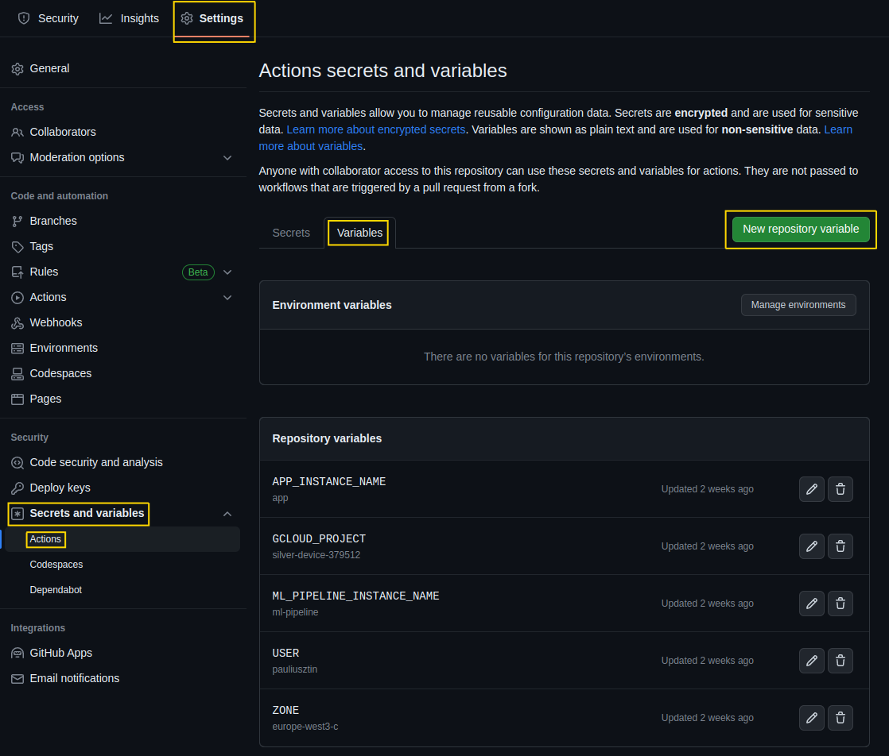
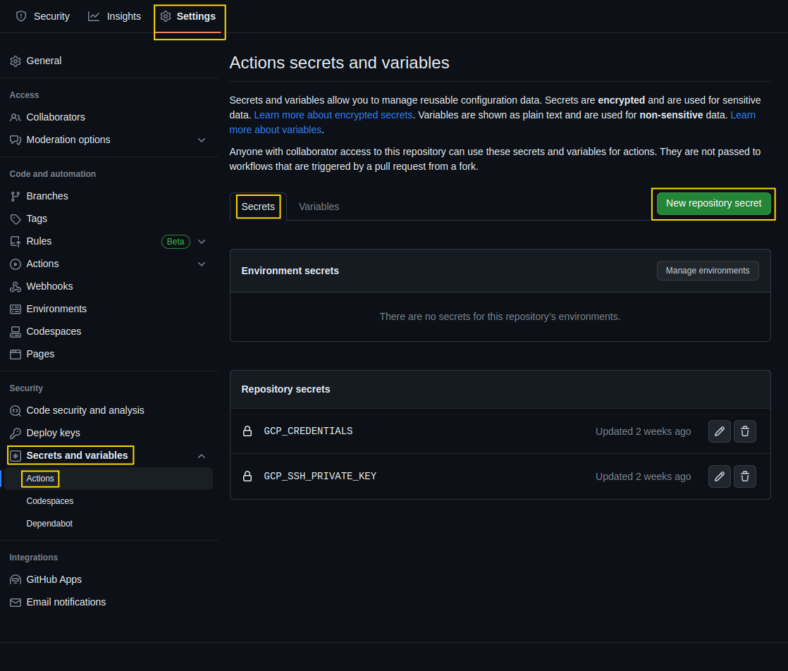
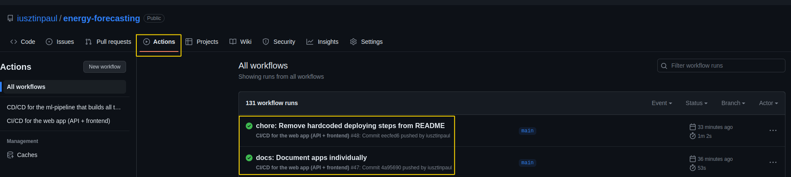

# The Full Stack 7-Steps MLOps Framework

Congratulations, you are close to the whole experience if you reached this far. This is the last step from the 7 lessons of the course.

**NOTE:** You can finish this lesson only if you deploy your code to GCP. If you haven't. [Check out this section to see how.](https://github.com/iusztinpaul/energy-forecasting/blob/main/README_DEPLOY.md)

[Access Lesson 7 on Medium for more detailed step-by-step instructions.](https://towardsdatascience.com/seamless-ci-cd-pipelines-with-github-actions-on-gcp-your-tools-for-effective-mlops-96f676f72012).

# CI/CD

We will use GitHub Actions to create the CI/CD pipeline. GitHub Actions will let us run various commands on specific triggers, such as a new commit to a branch.

## Fork the Repository

By forking the repository, you will create the exact identical copy of the code on your own GitHub account. Thus, you will have full access to the settings of the repository.

[Check out this doc to see how to fork a repository on GitHub.](https://docs.github.com/en/get-started/quickstart/fork-a-repo)

## Set Actions Variables

Go to your forked repository. After go to `Settings` -> `Secrets and variables` (in the Security tab) -> `Actions`.

Now, click `Variables`. You can create a new variable from that section by clicking `New repository variable`.

See the image below 👇

<p align="center">
  
</p>

You have to create 5 variables that will be used by the GitHub Actions scripts:
* `APP_INSTANCE_NAME` : the name of the web app VM. | In our case, it is `app`. The default should be ok if you use our recommended naming conventions.
* `GCLOUD_PROJECT` : the ID of your GCP Project | Here, you have to change it with your own project ID.
* `ML_PIPELINE_INSTANCE_NAME` : the name of the ML pipeline VM. | In our case, it is `ml-pipeline`. The default should be ok if you use our recommended naming conventions.
* `USER`: the user you used to connect to the VMs while settings up the machine using the SSH connection. | Mine was `pauliusztin`, but you must change it with yours.
* `ZONE` : the zone where you deployed the VMs. | The default should be ok if you use our recommended naming conventions.

## Set Secrets

In the same `Secrets and variables/Actions` section, hit the `Secrets` tab. 

You can create a new secret by pressing the `New repository secret` button.

These are similar to the variables we just completed, but after you fill in their values, you can't see them anymore. That is why these are called secrets. Here is where you add all your sensitive information. In our case, the GCP credentials and private keys.

See the image below 👇

<p align="center">
  
</p>

The `GCP_CREDENTIALS` secret contains the content of the JSON key of your VM admin service account. By settings this up, the CI/CD pipeline will use that service account to authenticate to the VMs.

Because the content of the file is in JSON format, you have to run the following commands:

Install the jq CLI: 
```shell
sudo apt update
sudo apt install -y jq
jq --version
```
Format your JSON key file:
```shell
jq -c . /path/to/your/admin-vm.json 
```
Take the output of this command and create your `GCP_CREDENTIALS` secret with it.

The `GCP_SSH_PRIVATE_KEY` is your GCP private SSH key (not your personal one - GCP creates an additional one automatically), which was built on your local computer when you used SSH to connect to the VMs.

To copy it, run the following:
```shell
cd ~/.ssh
cat google_compute_engine
```
Copy the output from the terminal and create the `GCP_SSH_PRIVATE_KEY` variable. 


## Run the CI/CD Pipeline

Now make any change to the code, push it to the main branch, and the GitHub Actions files should trigger automatically.

To see their results, check your GitHub repository's `Actions` tab.

<p align="center">
  
</p>

Two actions will be triggered. One will build and deploy the `ml-pipeline` modules to your `ml-pipeline` GCP VM, and one will build and deploy the `web app` to your `app` GCP VM. 

If you want to understand better how we wrote the GitHub Actions scripts under the `.github/workflows` directory [check out the **"CI/CD Pipeline Using GitHub Actions"** section of Lesson 7 on Medium](https://towardsdatascience.com/seamless-ci-cd-pipelines-with-github-actions-on-gcp-your-tools-for-effective-mlops-96f676f72012) that explains everything in detail.
