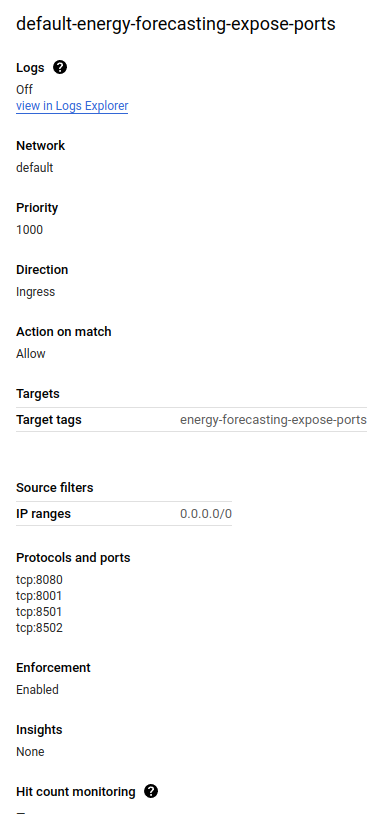
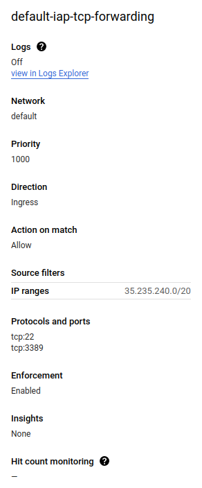
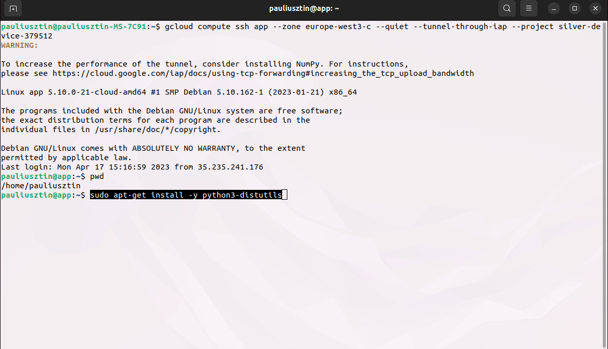
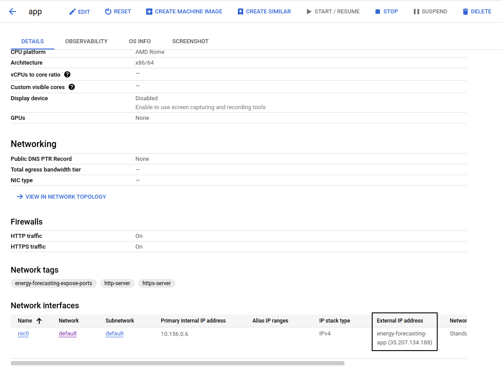

# The Full Stack 7-Steps MLOps Framework

### 🔥 LIVE DEMO 🔥 | [WEB APP - FORECASTING](http://35.207.134.188:8501/) | [WEB APP - MONITORING](http://35.207.134.188:8502/)

--------

# Deploy to GCP

This step must only be finished if you want to deploy the code on GCP VMs and build the CI/CD with GitHub Actions.

Note that this step might result in a few costs on GCP. It won't be much. While I was developing this course, I spent only ~20$, and it will probably be less for you.

Also, you can get some free credits if you have a new GCP account. Just be sure to delete the resources after you finish the course.


## General Set Up

Before setting up the code, we need to go to our GCP `energy_consumption` project and create a few resources. After we can SSH to our machines and deploy our code.


#### GCP Resources

- create static external IP address - [docs](https://cloud.google.com/compute/docs/ip-addresses/reserve-static-external-ip-address#console)


### Admin VM Service Account with IAP Access

We need a new GCP service account that has admin rights when working with GCP VMs & IAP access. You have to assign the following roles:
* Compute Instance Admin (v1)
* IAP-secured Tunnel User
* Service Account Token Creator
* Service Account User

IAP stands for Identity-Aware Proxy. It is a way to create tunnels that route TCP traffic. For your knowledge, you can read more about this topic using the following docs:
* [Using IAP for TCP forwarding](https://cloud.google.com/iap/docs/using-tcp-forwarding)
* [Overview of TCP forwarding](https://cloud.google.com/iap/docs/tcp-forwarding-overview)

### Expose Ports Firewall Rule

Create a firewall rule that exposes the following TCP ports: 8501, 8502, 8001.

Also, add a `target tag` called `energy-forecasting-expose-ports`.

Here is how my firewall rule looks like:

<p align="center">
  
</p>

Here are 2 docs that helped me create and configure the ports for the firewall rule:
* [Doc 1](https://stackoverflow.com/questions/21065922/how-to-open-a-specific-port-such-as-9090-in-google-compute-engine)
* [Doc 2](https://www.howtogeek.com/devops/how-to-open-firewall-ports-on-a-gcp-compute-engine-instance/)


### IAP for TCP Tunneling Firewall Rule

Now we will create a firewall rule that will allow IAP for TCP Tunneling on all the VMs that are connected to the `default` network.

[Docs on how to create the firewall rule.](https://cloud.google.com/iap/docs/using-tcp-forwarding#preparing_your_project_for_tcp_forwarding)

Here is how my firewall rule looks like:

<p align="center">
  
</p>


### VM for the Pipeline

Go to your GCP `energy_consumption` project -> VM Instances -> Create Instance

Choose `e2-standard-2: 2 vCPU cores - 8 GB RAM`

Call it: `ml-pipeline`

Change the disk to `20 GB Storage`

Pick region `europe-frankfurt` and zone `europe-west3-c`

Network: `default`

Also, check the `HTTP` and `HTTPS` boxes and add the `energy-forecasting-expose-ports` custom firewall rule we did a few steps back.

Here are 2 docs that helped me create and configure the ports for the firewall rule:
* [Doc 1](https://stackoverflow.com/questions/21065922/how-to-open-a-specific-port-such-as-9090-in-google-compute-engine)
* [Doc 2](https://www.howtogeek.com/devops/how-to-open-firewall-ports-on-a-gcp-compute-engine-instance/)


### VM for the Web App

Go to your GCP `energy_consumption` project -> VM Instances -> Create Instance

**Here are the VM configurations:**

This one can be as small as: `e2-micro: 0.25 2 vCPU - 1 GB memory` 

Call it: `app`

Change the disk to: `15 GB standard persisted disk`

Pick region `europe-frankfurt` and zone `europe-west3-c`

Network: `default`

Also, check the `HTTP` and `HTTPS` boxes and add the `energy-forecasting-expose-ports` custom firewall rule we did a few steps back.

Here are 2 docs that helped me create and configure the ports for the firewall rule:
* [Doc 1](https://stackoverflow.com/questions/21065922/how-to-open-a-specific-port-such-as-9090-in-google-compute-engine)
* [Doc 2](https://www.howtogeek.com/devops/how-to-open-firewall-ports-on-a-gcp-compute-engine-instance/)


### External Static IP

If we want the external IP for our web app to be static (aka not to change) we have to attach a static address to our web app VM.

More exactly, to the `app` VM we created a few steps ahead. If you want to repeat this process for the `ml-pipeline` VM that is perfetly fine. 

[Docs on reserving a static external IP address.](https://cloud.google.com/compute/docs/ip-addresses/reserve-static-external-ip-address)


----

#### Finally, all the boring setup is done. Let's start deploying our code 👇 👇 👇 


## Deploy - General Steps

### Configure Your Service Account

We will use your service account configured with admin rights for VMs and IAP access to SSH from your local machine to the GCP VMs.

First, we have to tell the `gcloud` GCP CLI to use that service account.

To do so, you have to create a key for your service account and download it as a JSON file (same as you did for the buckets service accounts - [here are some docs to refresh your mind](https://cloud.google.com/iam/docs/keys-create-delete)).

After you downloaded the file you just have to run the following `gcloud` command:
```shell
gcloud auth activate-service-account SERVICE_ACCOUNT@DOMAIN.COM --key-file=/path/key.json --project=PROJECT_ID
```

[Check out this docs for more details about the gcloud auth command](https://cloud.google.com/sdk/gcloud/reference/auth/activate-service-account).

Now whenever you run commands with `gcloud` it will use this service account to authenticate.


## Deploy - The Pipeline

Let's connect through SSH to the `ml-pipeline` GCP VM you created a few steps ahead:
```shell
gcloud compute ssh ml-pipeline --zone europe-west3-c --quiet --tunnel-through-iap --project <your-project-id>
```
**NOTE 1:** Change the `zone` if you haven't created a VM with the same zone as us.<br/>
**NOTE 2:** Your `project-id` is NOT your `project name`. Go to your GCP projects list and you will find the project id.

Starting this point, if you configured the firewalls and service account OK, as everything is Dockerized, all the steps will be 99% similar as the ones from the [Set Up Additional Tools](https://github.com/iusztinpaul/energy-forecasting#-set-up-additional-tools-) and [Usage](https://github.com/iusztinpaul/energy-forecasting#usage) sections.

You can go back and follow the exact same steps, while your terminal has an SSH connection with the GCP machine.

Note that the GCP machine is a linux machine. Thus, this time, the commands I used in the README.md will work just fine.

<p align="center">
  
</p>

Now you have to repeat all the steps you've done setting `The Pipeline` locally, but using this SSH connection.

### BUT YOU HAVE TO KEEP IN MIND THE FOLLOWING:

**Clone the code in the home directory of the VM:**

Just SHH to the VM and run:
```shell
git clone https://github.com/iusztinpaul/energy-forecasting.git
cd energy-forecasting
```

**Install Docker using the following commands:** <br/><br/>
Install Docker:
```shell
sudo apt update
sudo apt install --yes apt-transport-https ca-certificates curl gnupg2 software-properties-common
curl -fsSL https://download.docker.com/linux/debian/gpg | sudo apt-key add -
sudo add-apt-repository "deb [arch=amd64] https://download.docker.com/linux/debian $(lsb_release -cs) stable"
sudo apt update
sudo apt install --yes docker-ce
```
Add sudo access to Docker:
```shell
sudo usermod -aG docker $USER
logout 
```
Login again to your machine:
```shell
gcloud compute ssh ml-pipeline --zone europe-west3-c --quiet --tunnel-through-iap --project <your-project-id>
```

**Replace all `cp` commands with `gcloud compute scp`:** <br/><br/>

This command will help you to copy files from your local machine to the VM.

For example, instead of running:
```shell
cp -r /path/to/admin/gcs/credentials/admin-buckets.json credentials/gcp/energy_consumption
```

Run in a different terminal (not the one connected with SSH to your VM):
```shell
gcloud compute scp --recurse --zone europe-west3-c --quiet --tunnel-through-iap --project <your-project-id> /local/path/to/admin-buckets.json ml-pipeline:~/energy-forecasting/airflow/dags/credentials/gcp/energy_consumption/
```
This command will your local `admin-buckets.json` file directly to the `ml-pipeline` VM.


**!!!** And this is all. All the other steps are the same as running locally. Basically, only Docker has a slight different installation and you need a different way to copy files from your local machine to the VM. 


Now go to your VM view from GCP and go to the `Network tags` section. There you will find the `External IP address` column as shown in the image bellow. Copy that ip and attach port `8080` and vualua. You connected to your self hosted Airflow application.

Note that if it doesn't, give it a few seconds to load up properly.

For example, based on the `External IP address` from the image below I accessed Airflow using this address: `35.207.134.188:8080`. 

<p align="center">
  
</p>


## Deploy - The Web App
Let's connect through SSH to the `app` GCP VM you created a few steps ahead:
```shell
gcloud compute ssh app --zone europe-west3-c --quiet --tunnel-through-iap --project <your-project-id>
```
**NOTE 1:** Change the `zone` if you haven't created a VM with the same zone as us.<br/>
**NOTE 2:** Your `project-id` is NOT your `project name`. Go to your GCP projects list and you will find the project id.

This time you are in luck. You can repeat the exact same steps as in the [Deploy - The Pipeline Section](https://github.com/iusztinpaul/energy-forecasting/blob/main/README_DEPLOY.md#deploy---the-pipeline).

You have to consider the exact same observations, while repeating the steps for `The Web App` from the [Set Up Additional Tools](https://github.com/iusztinpaul/energy-forecasting#-set-up-additional-tools-) and [Usage](https://github.com/iusztinpaul/energy-forecasting#usage) sections.


----

As you can see, here we have done everything manually. If you want to see how we created a simple CI/CD using GitHub Actions [check out this section](https://github.com/iusztinpaul/energy-forecasting/blob/main/README_CICD.md).
